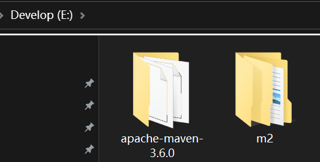

# 001-Idea配置Maven

## 一、解压Maven

将**apache-maven-3.6.0.zip**压缩包解压到本地，尽量不要在c盘，并在同级目录下创建叫**m2**的目录。



## 二、创建空Maven项目

打开Idea，点击**New Project**，配置如下图。


配置完成后点击Create创建项目。

## 三、配置本地Maven

左上角依次点击File --> Settings打开设置面板，如下图进行本地Maven配置。


点击ok后完成本地Maven配置。

## 四、Maven测试

在pom.xml文件中，加入junit的坐标依赖，尝试获取junit包，测试maven仓库下载。

junit依赖坐标如下。

```xml
        <!--junit单元测试-->
        <dependency>
            <groupId>junit</groupId>
            <artifactId>junit</artifactId>
            <version>4.12</version>
            <scope>test</scope>
        </dependency>
```

**完整pom.xml文件如下**

```xml
<?xml version="1.0" encoding="UTF-8"?>
<project xmlns="http://maven.apache.org/POM/4.0.0"
         xmlns:xsi="http://www.w3.org/2001/XMLSchema-instance"
         xsi:schemaLocation="http://maven.apache.org/POM/4.0.0 http://maven.apache.org/xsd/maven-4.0.0.xsd">
    <modelVersion>4.0.0</modelVersion>

    <groupId>com.javaee</groupId>
    <artifactId>ex01</artifactId>
    <version>1.0-SNAPSHOT</version>

    <properties>
        <maven.compiler.source>8</maven.compiler.source>
        <maven.compiler.target>8</maven.compiler.target>
        <project.build.sourceEncoding>UTF-8</project.build.sourceEncoding>
    </properties>

    <dependencies>
        <!--junit单元测试-->
        <dependency>
            <groupId>junit</groupId>
            <artifactId>junit</artifactId>
            <version>4.12</version>
            <scope>test</scope>
        </dependency>

    </dependencies>

</project>
```

修改完pom.xml文件后点击idea右侧maven图标，点击刷新，左侧查看是否加载junit包，如下图.


