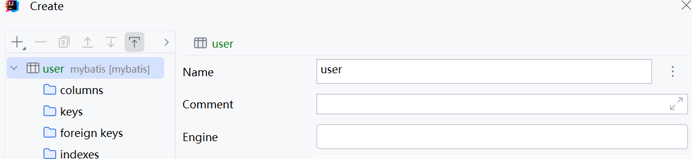

# 003-Idea连接MySQL

## Idea连接MySQL数据库

1. 按下图顺序依次点击

   

2. 配置数据库连接信息。

   

3. 配置连接完成后显示如下图。

   

4. 点击上图中红色部分，选择第一个all schema查看现有数据库，如下图

   

5. 右键顶层连接(mybatis)，依次选择new -> schema创建新数据库mybatis。

   

6. 配置新数据库mybatis如下图。

   

7. 选中新数据库mybatis，右键new -> table

   

8. 新建数据库user，配置如下。

   

9. 右键columns，new -> column配置如下

   

10. 将user_id设置为主键，右键user_id，new -> primary key

    

11. 继续重复第9步，分别创建username，password列，类型设置为varchar(64)，完成后ok，如下图。

    

12. 完成后右侧双击user表进行查看。

    

