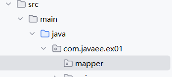
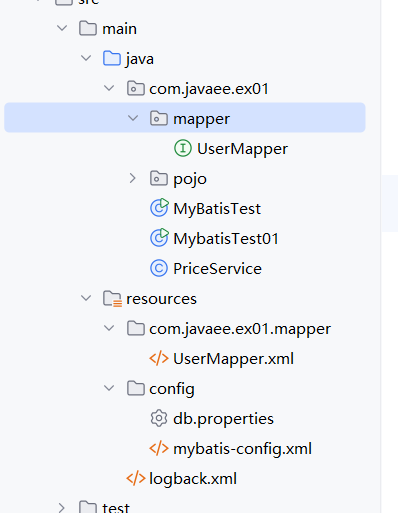

# 006-Mapper代理开发

## 一、创建mapper包

在src/main/java/com/javaee/ex01下创建mapper包。



## 二、创建UserMapper接口

内容如下

```java
public interface UserMapper {

    List<User> selectAllUser();

}
```

## 三、resource目录下创建同名包和mapper

在resource目录下创建com/javaee/ex01/mapper目录，并把UserMapper.xml文件移动到新创建的目录中，效果如下



## 四、修改mybatisi-config.xml文件

修改mappers标签内的部分，更换为包扫描模式

```xml
    <mappers>
		<!-- <mapper resource="mapper/UserMapper.xml"/>-->
        <package name="com.javaee.ex01.mapper"/>
    </mappers>
```

## 五、创建测试用例

在src/test/java/com/javaee/ex01包下创建测试用例UserMapperTest.java

```java
public class UserMapperTest {

    @Test
    public void selectAllUserTest() throws IOException {
        String resource = "config/mybatis-config.xml";
        InputStream inputStream = Resources.getResourceAsStream(resource);
        SqlSessionFactory sqlSessionFactory = new SqlSessionFactoryBuilder().build(inputStream);

        //  1. 与数据库建立连接
        SqlSession session = sqlSessionFactory.openSession();
        UserMapper mapper = session.getMapper(UserMapper.class);
        List<User> users = mapper.selectAllUser();
        System.out.println(users);
        session.close();

    }
}
```

运行测试用例