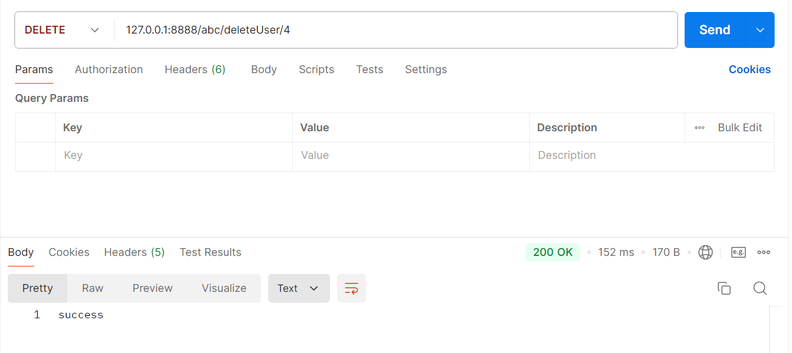

# 010-课后作业

## 编写代码完成对用户的增删查改操作

根据Restful接口开发风格，对用户的增删差改操作将分别使用get,post,put和delete四种请求

- get：查询
- post：添加
- put：修改
- delete：删除

### 1. 编码

1. UserMapper接口中编写sql查询语句

```java
@Mapper
public interface UserMapper {
    @Select("select  * from user where user_id = #{userId};")
    User getUserById(int userId);

    //添加用户
    @Insert("insert into user (username, password) values (#{username}, #{password});")
    int insertUser(User user);

    //修改用户
    @Update("update user set username = #{username}, password = #{password} where user_id = #{userId};")
    int updateUser(User user);

    //删除用户
    @Delete("delete from user where user_id = #{userId};")
    int deleteUser(int userId);
}
```

2. UserService接口中编写接口

```java
public interface UserService {
    // 根据id查询用户
    User getUserById(Integer id);

    //添加用户
    int insertUser(User user);

    //修改用户
    int updateUser(User user);

    //删除用户
    int deleteUser(int userId);
}
```

3. UserServiceImpl中完成接口实现

```java
@Service
public class UserServiceImpl implements UserService {
    // @Autowired // Spring工程的注解，进行自动装备
    @Resource  // Java内置的注解，也能进行自动装配
    private UserMapper userMapper;

    @Override
    public User getUserById(Integer id) {
        User user = userMapper.getUserById(id);
        System.out.println(user);
        return user;
    }

    @Override
    public int insertUser(User user) {
        return userMapper.insertUser(user);
    }

    @Override
    public int updateUser(User user) {
        return userMapper.updateUser(user);
    }

    @Override
    public int deleteUser(int userId) {
        return userMapper.deleteUser(userId);
    }
}
```

4. UserController中配置请求路由

```java
@RestController
@RequestMapping
public class UserController {
    @Resource
    private UserService userService;

    @GetMapping("/getUserById")
    public User getUserById(Integer id) {
        User user = userService.getUserById(id);
        return user;
    }

    @PostMapping("/insertUser")
    public String insertUser(User user) {
        int row = userService.insertUser(user);
        if (row > 0) {
            return "success";
        }
        return "fail";
    }

    @PutMapping("/updateUser")
    public String updateUser(User user) {
        System.out.println(user);
        int row = userService.updateUser(user);
        if (row > 0) {
            return "success";
        }
        return "fail";
    }

    @DeleteMapping("/deleteUser/{userId}")
    public String deleteUser(@PathVariable Integer userId) {
        int row = userService.deleteUser(userId);
        if (row > 0) {
            return "success";
        }
        return "fail";
    }
}
```

### 2.测试

使用postman进行接口测试




