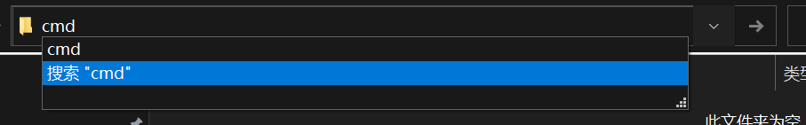
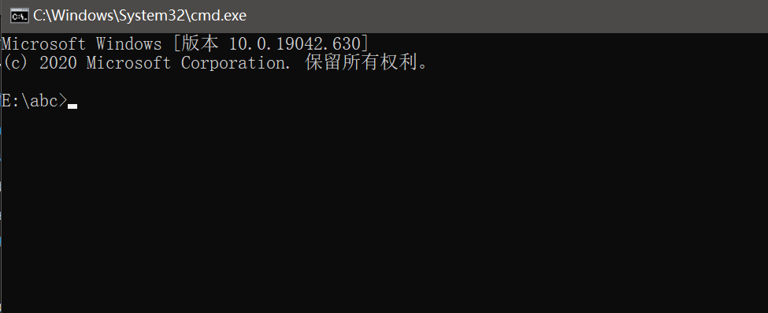
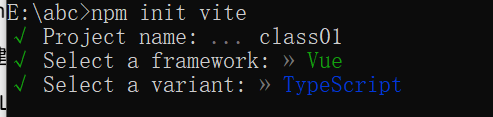
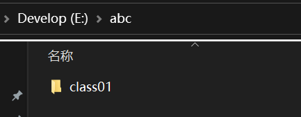
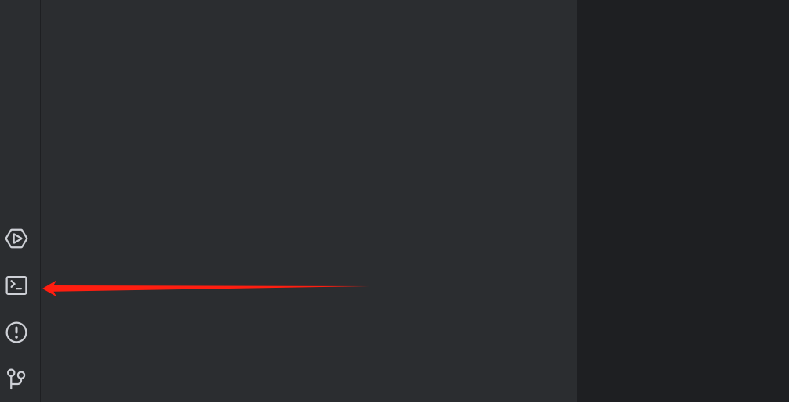
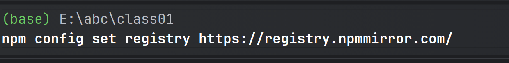
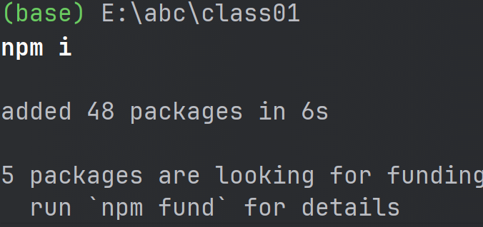
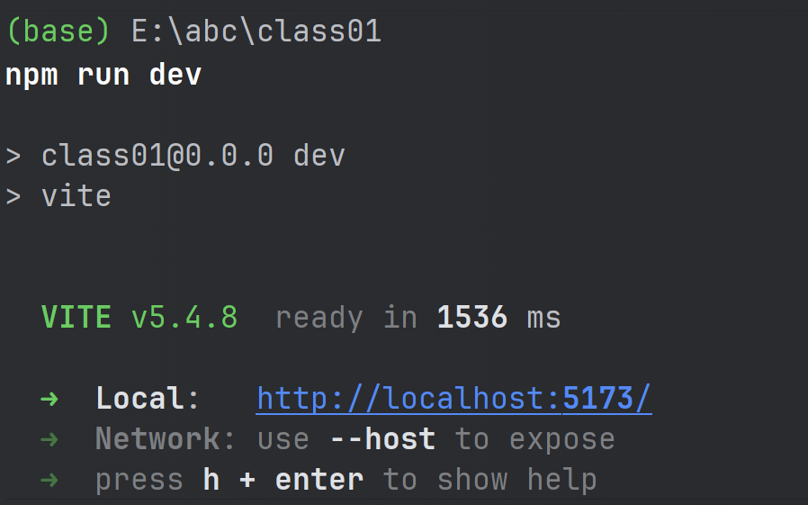
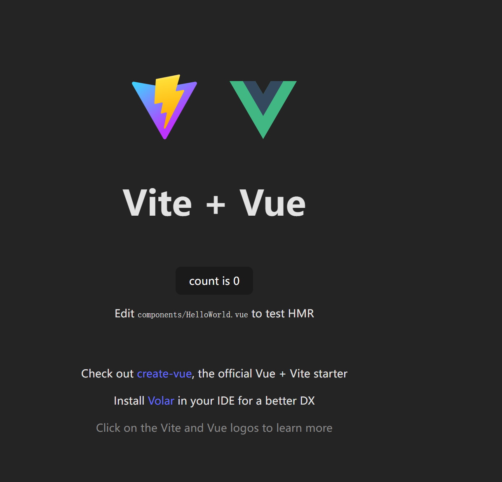

# 013-Vite创建Vue3工程

## 一、环境准备

- 下载安装好nodejs
- 下载安装好webstorm或者vscode

## 二、创建工程

进入需要创建项目的目录，在地址栏输入cmd回车打开命令行窗口。





在命令行窗口输入以下命令创建项目

```shell
npm init vite
# 如果提示询问y/n则输入y然后回车
```

项目名输入`class01`回车

框架选择`Vue`回车

语法选择`TypeScript`回车



此时在回到项目目录可以看到项目已经完成构建，项目目录下成功创建了一个class01的文件夹



此时项目构建成功，使用webstorm打开该文件夹。


## 三、安装依赖包并启动

使用webstorm打开项目后，找到终端按钮并打开（一般在左下角，和你的cmd窗口长得一样，输入命令的）



打开后先换源，在终端中输入如下命令

```shell
npm config set registry https://registry.npmmirror.com/
```



然后输入下方`npm i`安装依赖包



完成后输入`npm run dev`启动项目



点击链接打开项目页面



完成项目构建！

