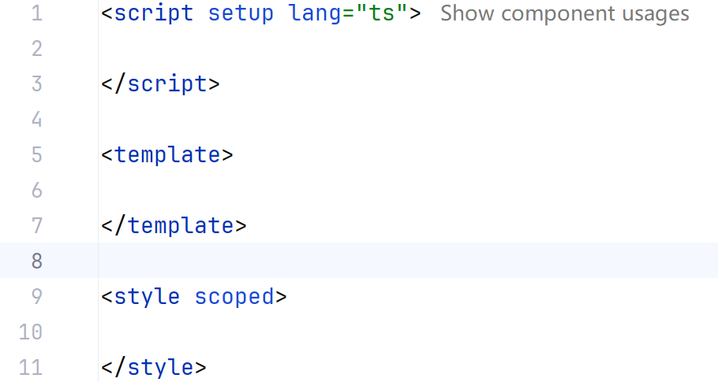
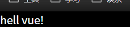

# 014-Vue3基本语法和使用


删除App.vue文件中的所有代码，仅保留核心的三个标签

- `<script setup lang="ts"></script>`
- `<template></template>`
- `<style scoped></style>`



删除`component`目录下的所有文件，清除`style.css`文件中的所有内容

开始清除vue3自带的css样式，在`style.css`文件中写入以下内容

```css
/* reset.css */
html, body, div, span, applet, object, iframe,
h1, h2, h3, h4, h5, h6, p, blockquote, pre,
a, abbr, acronym, address, big, cite, code,
del, dfn, em, img, ins, kbd, q, s, samp,
small, strike, strong, sub, sup, tt, var,
b, u, i, center,
dl, dt, dd, ol, ul, li,
fieldset, form, label, legend,
table, caption, tbody, tfoot, thead, tr, th, td,
article, aside, canvas, details, embed,
figure, figcaption, footer, header, hgroup,
menu, nav, output, ruby, section, summary,
time, mark, audio, video {
    margin: 0;
    padding: 0;
    border: 0;
    font-size: 100%;
    font: inherit;
    vertical-align: baseline;
    box-sizing: border-box;
    outline: none;
}
/* 更多的样式重置规则 */
```

在`App.vue`文件中写入以下内容进行测试

```vue
<script setup lang="ts">

</script>

<template>
  <h1 class="title">hell vue!</h1>
</template>

<style scoped>
.title{
  background-color: black;
  color: aliceblue;
}
</style>

```

完成后在终端输入`npm, run dev`启动项目，浏览器打开项目，检测标签与浏览器是否有边距，无边距则配置成功



App.vue文件课堂内容

```vue
<script setup lang="ts">
// 定义常量
import {reactive, ref} from "vue";

const value1 = 1
// 定义变量
// let value2 = 3
// 定义响应式变量，有两个关键字ref , reactive
let value2 = ref(1)
let people = reactive({
  'name': '孙悟空',
  'age': 8888,
})

// 点击按钮之后，修改value2的值
// 定义一个函数，每次执行函数的时候value2的值+1
// 定义函数的方法一：使用function关键字(传统js的写法)
function add(){
  value2.value += 1
  console.log(value2)
}
// 定义函数的方法二：箭头函数(新版写法，较为常用)
const add1 = () => {
  value2.value += 2
}

// alert(123)  // 利用对话框查看信息
console.log(value2)  // 利用控制台查看日志信息

const leveUp = () => {
  people.age += 1
}

// add()
// add1()

</script>

<template>
  <h1 class="title">value1 - {{ value1 }}</h1>
  <h1 class="title">已经送出地狱火的数量 - {{ value2 }}</h1>
<!--  <button onclick="add">扣1送地狱火！</button>-->
  <button @click="add">扣1送地狱火！</button>
  <h1 class="title">{{ people }}</h1>
  <button @click="leveUp">点击充值，可以升级！</button>
</template>

<style scoped>
.title{
  font-size: 3em;
}

</style>

```

